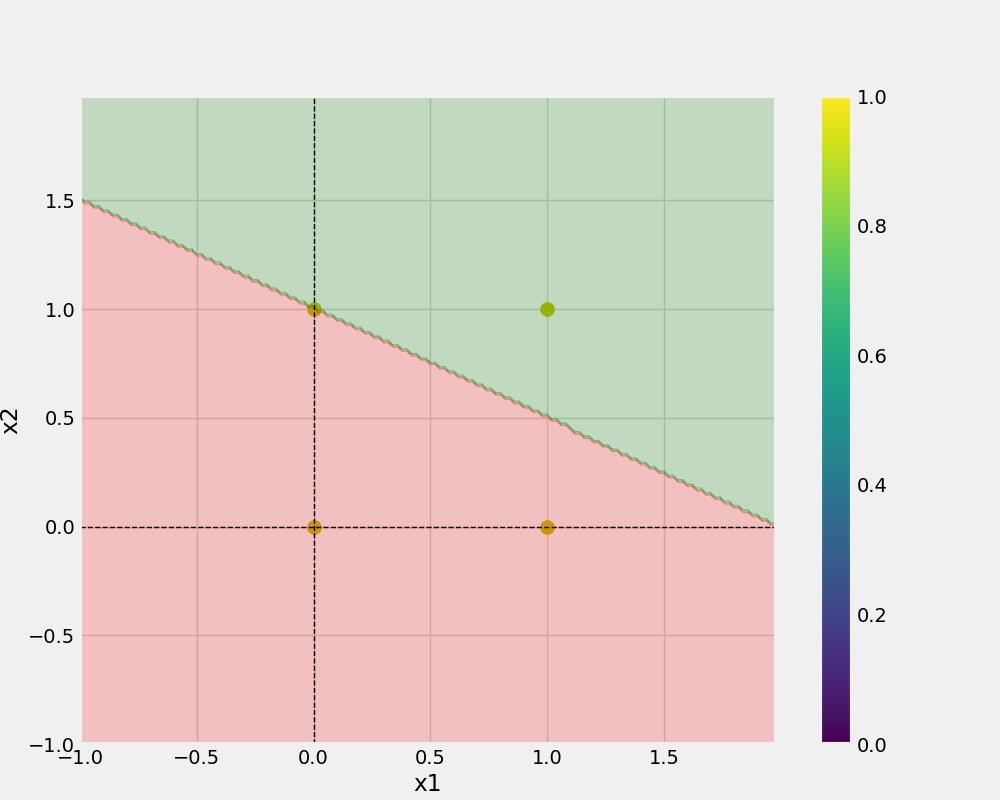
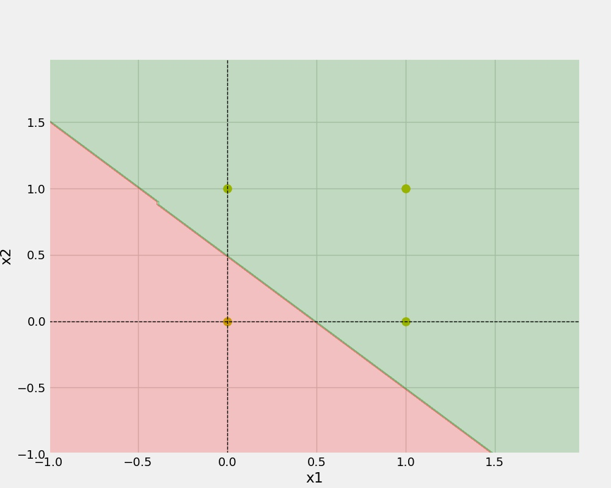
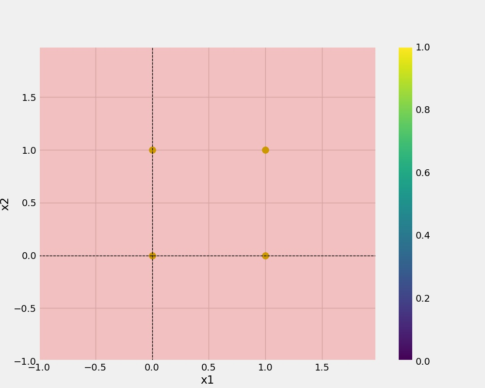

# Perceptron Implementation

Perceptron means a single neuron. This project is basically a Implementation
of a Perceptron from scratch. 

In a Perceptron there are 2 tasks to execute : 
    
    1. Linear Combination of weights and inputs 
    2. Applying activation Function

## Diagramatic Representation of Perceptron

  
## Linear Combnation of Weights and Input

y = w1 * x1 + w2 * x2 + w3 * x3 ...............  wn * xn + b

### Representation as Matrix

Y = [w1  w2  w3 ] * [ x1 x2 x3  ]T  + b

## Activation Function

Here we have used Step function as Activation Function

For a Value greater than or equal to 0 it return 1 and for less than 0
it returns 0.

## Dataset used

Here we have used Logic Gates dataset where truth table of gates act as a dataset
. We have used three logic gates AND , OR , XOR

Dataset are 

#### 1. AND 

| X1 | X2 | Y |
| :-:|:--:|:-:|
| 0 | 0 | 0   |
| 0 |1  |  0  |
| 1 |0  |  0  |
| 1 |1  | 1   |

#### 2. OR

| X1 | X2 | Y |
| :-:|:--:|:-:|
| 0 | 0 |  0  |
| 0 |1  |  1  |
| 1 |0  |  1  |
| 1 |1  |  1  |

#### 3. XOR

| X1 | X2 | Y |
| :-:|:--:|:-:|
| 0 | 0 |  0  |
| 0 |1  |  1  |
| 1 |0  |  1  |
| 1 |1  |  0  |

## Drawback of Perceptron

1. It is a very bad predictor for Non linear Data. As it predicts very good for AND , OR gate but it predicts very bad for XOR gate.

### How to remove Drawback 

To remove this Drawback we use a Multi Layer Perceptron(MLP).

## Classification Plots for Gates

#### 1. AND

#### 2. OR

#### 3. XOR

